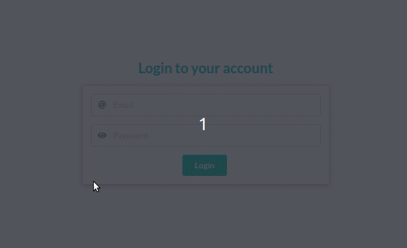

## Form Validation

<a href="https://react-form-validate.netlify.app/" target="_blank"><h3 align="left">Click here for demo</h3></a>

## Table of Contents

- [General info](#general-info)
- [Preview](#preview)
- [Technologies](#technologies)
- [Contact](#contact)

## General Info

Form validation built with React. There are plenty of libraries aiming exactly same problem. I just wanted to experiment my own form validation so that I could also use it later occasions. It covers a lot of edge cases to prevent any data leak. User will be informed with descriptive error messages when the login is unsuccessful so that the wrong information can be fixed again. Upon successful login user will be greeted with a welcome message. Feel free to try it out!

## Preview

## Technologies

- HTML
- CSS
- Javascript
- React
- Semantic-Ui

## Contact

Created by [eminaydin](https://github.com/eminaydin) - feel free to contact me for any inquiries!
