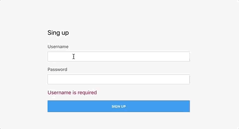
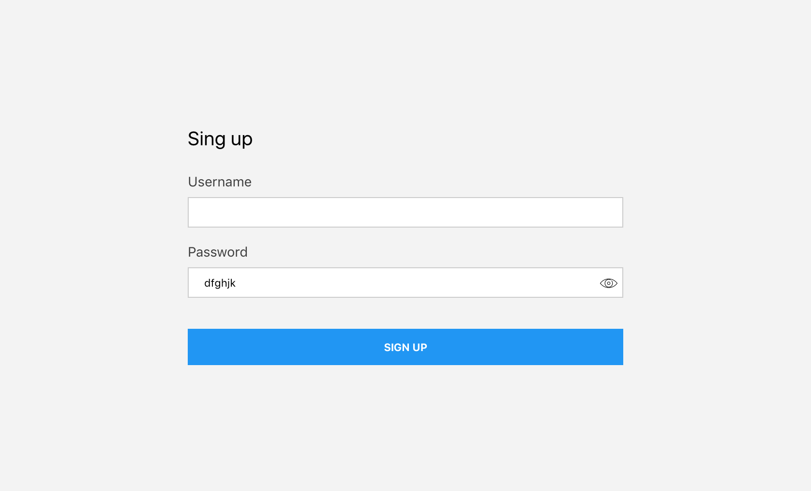

# Password validation

Create a sign up form that has 2 fields: user and password.

Whenever the user clicks on submit, we must validate the form. We want to display only 1 error at a time.

Checks for user:

- User name is required
- Username must be a valid email (we can simply check for the `@` sign)

Checks for password:

- Password is required
- Must contain at least 1 capital letter
- Must contain at least 1 special character (I used this list of special characters: https://docs.oracle.com/cd/E11223_01/doc.910/e11197/app_special_char.htm#MCMAD416)
- Must contain at least 1 number
- Must be 8 characters long
- Cannot contain the user name
    We can use the part before the `@` in the email as username

Once the form passes all validation, display a success message with the user's name (again use the part before the `@` in the email)

Take a look at this example: 

Extra:

- add password visibility toggle

